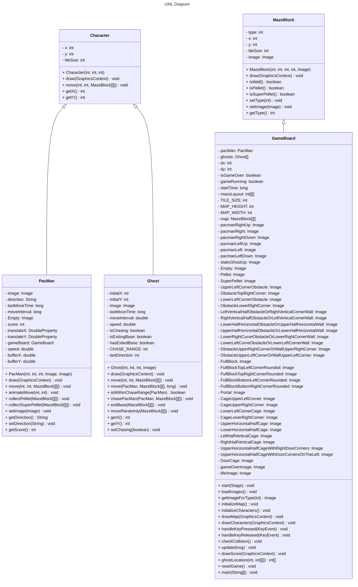

# Game-JAVA 📜
This repository is a teaching project developed during the Internship at the Systems Analysis and Development faculty.

## 📖 Description

The PACMAN game takes place through a maze, with the objective of eating all the lozenges and super lozenges scattered along the way. The player must avoid being captured by the ghosts that patrol the maze. When colliding with a tablet, PACMAN consumes it and it disappears from the maze. If the player manages to eat all the gum, he wins the game.

The development of this game was done in JavaFX.

## 🔍 Instructions

### 1. Welcome Screen:
* There will be two buttons, one to start the game and the other to see the controls. Both will be in the middle of the screen, the start game button will be on top of the controls button.

### 2. Gameplay

* PACMAN will spawn in the middle of the screen, his goal is to eat all the pellets that will be scattered around the map while escaping from the GHOSTS that will try to catch him.

* The score increases as PACMAN consumes the pellets, when PACMAN consumes the larger pellet the GHOSTS will be vulnerable and can also be consumed by PACMAN, there will be some fruits scattered around the map, if these fruits are consumed by PACMAN it will gain more score.

* When the game starts, four GHOSTS will spawn in the base, but only two will leave the base at first, only after 5 seconds, the other two GHOSTS will leave the base.

* The game ends only when PACMAN has consumed all the pellets scattered around the map. When the game ends, a new level begins. With each new level, there will be some changes making the game more difficult:
    > By consuming a large pellet, the vulnerability time of the GHOSTS will be shorter.

    > The movement speed of GHOSTS is increased.
    
    > The view distance of GHOSTS is increased.

## 🕹️ Controls
* W-A-S-D or arrow keys to move the character.
* Press 'ESC' to pause the game.

## 💻 Requirements
* Java IDE or Compiler required to run the game.

## 📥 Installation
To install the game you must have the JAVA Project Execution Software on your computer, the recommended software is
[🧷JetBrains IntelliJ IDEA Community Edition 2024.1.3](https://www.jetbrains.com/idea/download/?section=windows), which is what we used to develop the game.

After installing the software, the next step is to clone our project. To do this, follow this step by step:
 > Click: "<> Code" > HTTPS > Copy url to clipboard.

 > Open IntelliJ IDEA.
 
 > Click: Projects > Get from VCS > Repository URL > Git(Version Control) > Paste the url in "URL:" > Select the local directory in "Directory" > Clone.

#

# Game Class Diagram

